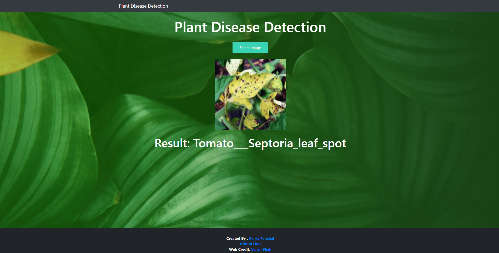

# Plant-Disease-detection-using-Deep-Learning
 
## Plant Disease Identification Using Convulutional neural Network

## Dataset

This dataset consists of about 87K rgb images of healthy and diseased crop leaves which is categorized into 38 different classes. The total dataset is divided into 80/20 ratio of training and validation set preserving the directory structure. A new directory containing 33 test images is created later for prediction purpose.

Link : https://www.kaggle.com/vipoooool/new-plant-diseases-dataset

  
